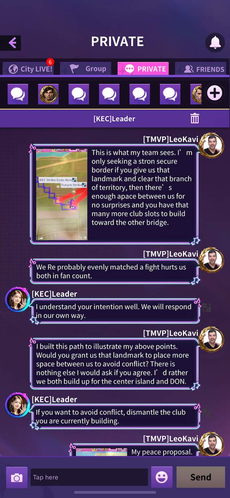
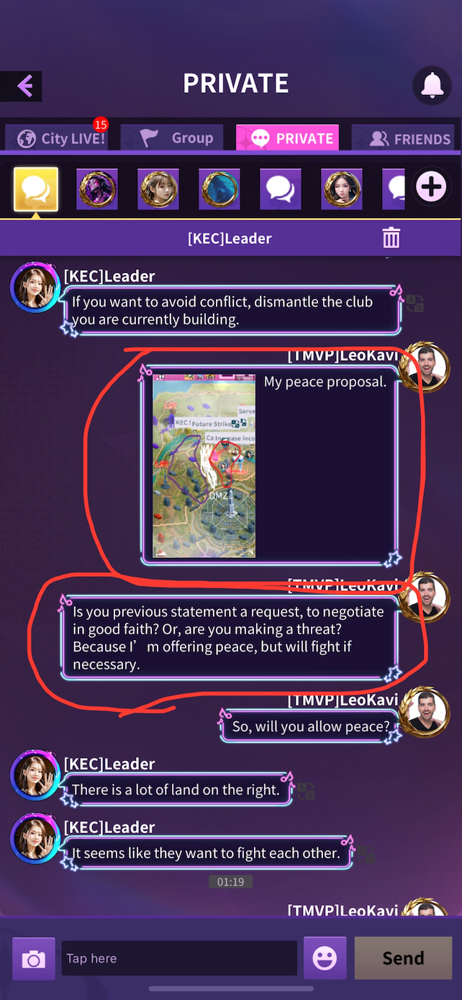
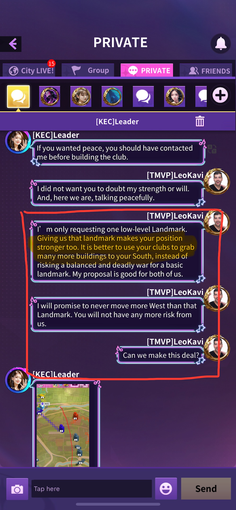
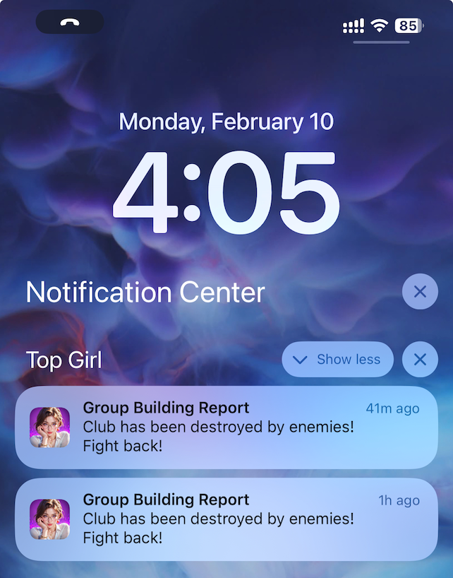

# KECvTMVP Truth

## How it started
_(with screenshots for proof)_

1. I showed openly and honestly what I wanted. I labeled the Landmark “*Future* Strike”, so **my team would not attack before talks**, and a “Stop” pin, so my team **would not go further** *if* we did get the landmark. I also explained why I thought it would be good for both of us. I expected a negotiation.
2. I pointed out that (at that time) we were evenly matched and should not fight.
3. In response, **[KEC]Leader threatened me**.
4. I tried to clarify since clearly [KEC]Leader misunderstood my intentions.
5. **[KEC]Leader made a threatening demand**.

6. I showed a **proposal** (*not a demand*) for **peace and mutual benefit**.
7. Then I asked for clarification about the apparent threat from [KEC]Leader, and **restated I wanted peace**, but would fight only **if necessary**. I hoped we could understand each other and negotiate something fair.
8. Then **I directly asked if they would allow peace**.

> **"If you wanted peace, you should have contacted me before building the club."** *~[KEC]Leader

9. **[KEC]Leader essentially declared war** at this point, for my *"building the club"*, not for anything violent or aggressive.
10. I tried yet again to clarify my proposal and why I thought it would be good for both of us.
11. I asked if we could make a deal, and then I went offline shortly after this point.

12. When I came back online six hours later, [KEC]Leader had gained over $300,000,000 in finance, clearly having spent a lot of money to grow so quick, and then attacked me and my team multiple times.

## How it escalated

[KEC]Leader went into the public city chat and repeatedly lied about what happened. This lying continued for days.

## Why it continues

Now, every other time I'm offline for a few hours I come back to something like this:
 

## Conclusion

This should put to bed any doubts that [KEC]Leader is a **liar, a belligerent, and a coward**.

Cheers!
